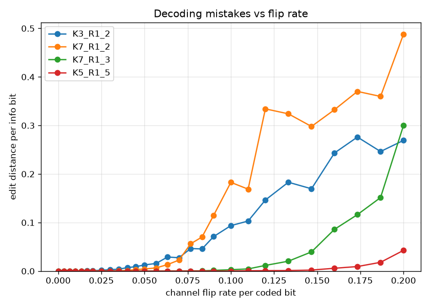
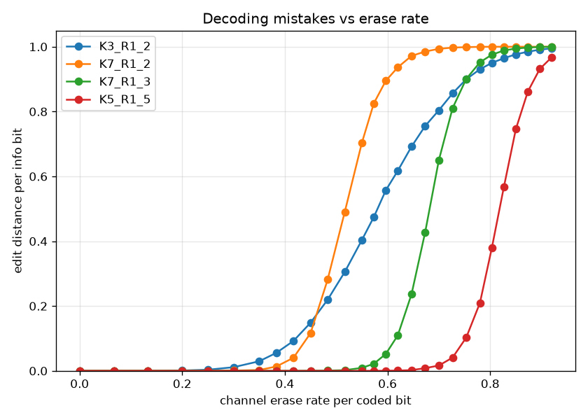
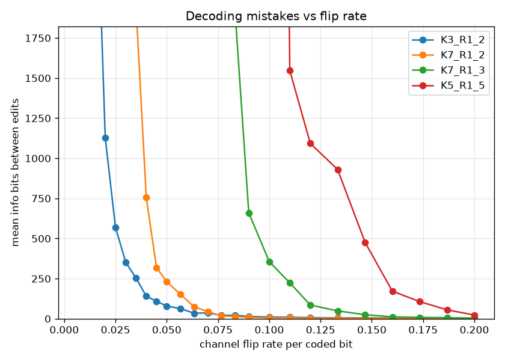
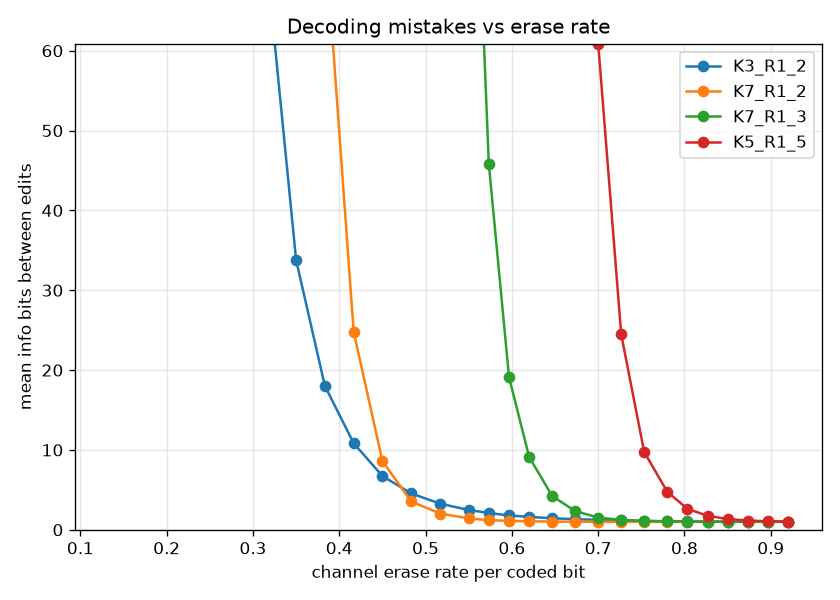

# bcjr metrics

`metrics/bcjr/dt_cc_bcjr_metrics.c` measures the decoding-mistake rate as a function
of the channel's flip and erase rates, for all four standard codes, for the
**bcjr** codec (a max-log-MAP / forward-backward hard-decision decoder). It is the
bcjr counterpart of [../hybrid/METRICS.md](../hybrid/METRICS.md) and
[../vindel/METRICS.md](../vindel/METRICS.md) — same Monte-Carlo framework (random
message → encode → channel → decode) and the same edit-distance metric — but, like
[../viterbi/METRICS.md](../viterbi/METRICS.md), restricted to the channel a no-drift
codec faces:

- bcjr does **not track inserted or dropped bits**, so only the **flip** and
  **erase** axes are swept. (Insert / delete would desync it; that is what vindel
  and hybrid are for.)
- The decoder takes a channel model (`decision_depth`, `p_flip`, `p_erase`). This
  harness runs the **matched** model: the decoder's rate for the swept impairment
  is set to the channel's rate (its best case), with `decision_depth ≈ 6·K`.
- Unlike viterbi, bcjr **blind-acquires** (it does not assume the encoder start
  state), so the first `~decision_depth` decoded bits are an acquisition transient
  and are dropped from both sequences before comparison.

The reported metric is the **normalized edit (Levenshtein) distance** between the
decoded bits and the original message over the kept window, divided by the number
of message bits (after trimming the flush tail). bcjr also emits a soft **lock
probability** (`c_locked`); this harness measures edit distance only.

> [!NOTE]
> The committed CSV is the full sweep: 30 trials per point over the shipped
> `rate_grids.txt` (28 rates per axis), seed `0xC0FFEE`. Plots are rendered into
> `plots/` (regenerate them with the plotting command below).

```sh
# Build the harness (off by default) and run the sweep to a CSV.
cmake -S . -B build -DDRIFTY_BUILD_BENCH=ON
cmake --build build --target dt_cc_bcjr_metrics
# dt_cc_bcjr_metrics <trials> <info_bits> <seed> <rate_grids_file>
#   defaults: 50 1000 0xC0FFEE, rate_grids_file = metrics/bcjr/rate_grids.txt
#   (so run from the repo root)
build/metrics/bcjr/dt_cc_bcjr_metrics 30 4000 0xC0FFEE > metrics/bcjr/metrics.csv

# Plot the edit and run-length metrics (one curve per code). Needs matplotlib:
python3 -m venv .venv && .venv/bin/pip install matplotlib
.venv/bin/python metrics/bcjr/plot_metrics.py metrics/bcjr/metrics.csv -o metrics/bcjr/plots/
```

Every run is reproducible from its `seed`: the sweep is fanned out across cores
with OpenMP when available, and each point owns a seeded PRNG stream, so a given
seed reproduces every row's values exactly regardless of thread count. The rate
grids are read at startup from `metrics/bcjr/rate_grids.txt` (or a path passed as
the 4th argument); each line is `<axis>  <rate> <rate> ...` (`#` begins a comment),
so a sweep can be retuned without recompiling.

The CSV columns are `code, metric, axis, rate, trials, ref_bits, edit_distance,
edit_rate` (`metric` is always `edit`). The plotter reads each CSV by column name,
so it shares the plotter with the other codecs; it simply finds no lock or
insert/delete data and skips those plots.

## Generated plots

The figures come from the full sweep described above. In every plot the x-axis is
the channel impairment rate per coded bit and the four curves are the standard
codes — `K3_R1_2`, `K7_R1_2` (rate 1/2), `K7_R1_3` (rate 1/3) and `K5_R1_5`
(rate 1/5), in order of increasing redundancy. Each code holds near zero up to a
per-code knee, then climbs; tolerance scales with redundancy, so `K5_R1_5` holds
out the longest. Erasures, carrying no wrong information, are tolerated to far
higher rates than flips. Per-code knees (first rate where the edit rate clears 1%):

| Code      | Flip   | Erase  |
|-----------|--------|--------|
| `K3_R1_2` | ~0.05  | ~0.30  |
| `K7_R1_2` | ~0.06  | ~0.38  |
| `K7_R1_3` | ~0.12  | ~0.57  |
| `K5_R1_5` | ~0.19  | ~0.70  |

### Edit distance (decoding mistakes per bit)

| Flip | Erase |
|---|---|
|  |  |

### Run length between edits

The reciprocal of the edit rate (`1 / edit_rate`): the average bits that get
through between mistakes. Effectively unbounded below each code's knee (those
zero-edit points are dropped) and drops off at the knee.

| Flip | Erase |
|---|---|
|  |  |
