# detect_clean metrics

`metrics/detect_clean/dt_detect_clean_metrics.c` measures the **detect_clean** blind
code-presence detector ([doc](../../doc/cc/detect_clean.md)) — exact GF(2)
sliding-window rank deficiency — across the four channel impairments, for each
standard code. It is the detect counterpart of the FEC harnesses (same Monte-Carlo
framework, same `[trials] [info_bits] [seed] [variation] [grids]` CLI), but
detect_clean does not recover bits, so the metrics are detection confidence rather
than edit distance.

> [!NOTE]
> **The committed CSVs and plots are a COARSE pass** (low trials / info_bits) for
> fast iteration on the grids and parameters. Re-run the full sweep (below) once the
> shape looks right.

## What is measured

detect_clean answers "is a convolutional code present?". For each point we run **two**
streams through the channel — a **coded** one and a same-length **pure random** one —
and average each of the detector's two soft confidences over the stream interior
(the head/tail abstain transient is trimmed):

- **present** (`c_erasure`) — confidence a code **is** present. High on coded, ~0 on
  random.
- **absent** (`c_absent`) — confidence a code is **not** present. ~0 on coded, high
  on random.

Emitting the random stream's means alongside the coded ones gives every plot a
pure-random **baseline**: detection works to the extent the coded curves stand clear
of it. Each axis (flip / insert / delete / erase) is swept independently.

## Variations (the decoder's channel model)

The detector takes a channel model, selected by a variation — the **parameterization
axis**:

- **pegged** (`untuned/`) — model fixed at a flat 1% on every impairment, whatever
  the channel does.
- **matched** (`tuned/`) — the swept impairment's model rate tracks the channel; the
  others stay at the 1% floor.

The model only calibrates **`c_absent`**: detect_clean damps its no-code confidence by
a detectability factor `(1 − p)^W` when it expects flips/overwrites (a code could be
hidden by them). So **matched FLIP and ERASE** sweeps pull the `c_absent` random
baseline down as the rate climbs (an expected-noisy channel can't confidently call a
stream code-free), while **`c_erasure` is identical across variations** (an observed
structure is real regardless of what you expected) and the **INSERT/DELETE** axes
barely move (indels are tolerated, not a reason to doubt "no code").

## Running

```sh
# Build the harness (off by default).
cmake -S . -B build -DDRIFTY_BUILD_BENCH=ON
cmake --build build --target dt_detect_clean_metrics

# Coarse pass (fast - what is committed):
build/metrics/detect_clean/dt_detect_clean_metrics 4 2500 0xC0FFEE pegged  > metrics/detect_clean/untuned/metrics.csv
build/metrics/detect_clean/dt_detect_clean_metrics 4 2500 0xC0FFEE matched > metrics/detect_clean/tuned/metrics.csv

# Full sweep (more trials / bits; run when done iterating):
build/metrics/detect_clean/dt_detect_clean_metrics 40 6000 0xC0FFEE pegged  > metrics/detect_clean/untuned/metrics.csv
build/metrics/detect_clean/dt_detect_clean_metrics 40 6000 0xC0FFEE matched > metrics/detect_clean/tuned/metrics.csv

# Plot both confidences (with the random baseline) into each variation's plots/.
python3 -m venv .venv && .venv/bin/pip install matplotlib   # once
.venv/bin/python metrics/detect_clean/plot_metrics.py metrics/detect_clean/untuned/metrics.csv -o metrics/detect_clean/untuned/plots/
.venv/bin/python metrics/detect_clean/plot_metrics.py metrics/detect_clean/tuned/metrics.csv   -o metrics/detect_clean/tuned/plots/
```

Every run is reproducible from its `seed` (each point owns a derived PRNG stream, so
the sweep fans out over OpenMP without changing the numbers). The per-axis rate grids
are read from `rate_grids.txt` (or a 5th-argument path), so a sweep retunes without
recompiling. CSV columns: `code, variation, axis, rate, dec_p_flip, dec_p_ins,
dec_p_del, dec_p_ovr_erase, trials, coded_present, coded_absent, random_present,
random_absent` (the `dec_*` columns record the model each point ran with).

## Reading the plots

One figure per (metric, axis): a solid curve per code (the coded value) and a dashed
**random baseline**. For `present`, the coded curves should ride high above a
near-zero baseline; for `absent`, they should sit low under a high baseline.
detect_clean holds full separation only at low rates (exact parity), decaying past
~1 % flips/indels and ~2 % erasures.

### Code-present confidence (`c_erasure`)

Identical between variations (the model does not affect it). Coded confidence falls
to the random floor past the codec's knee; shorter-constraint codes (lighter parity
checks) hold a little longer.

| axis | pegged | matched |
|---|---|---|
| flip   | 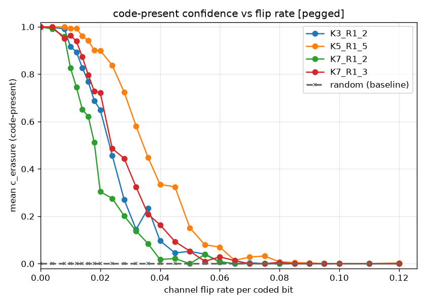 | 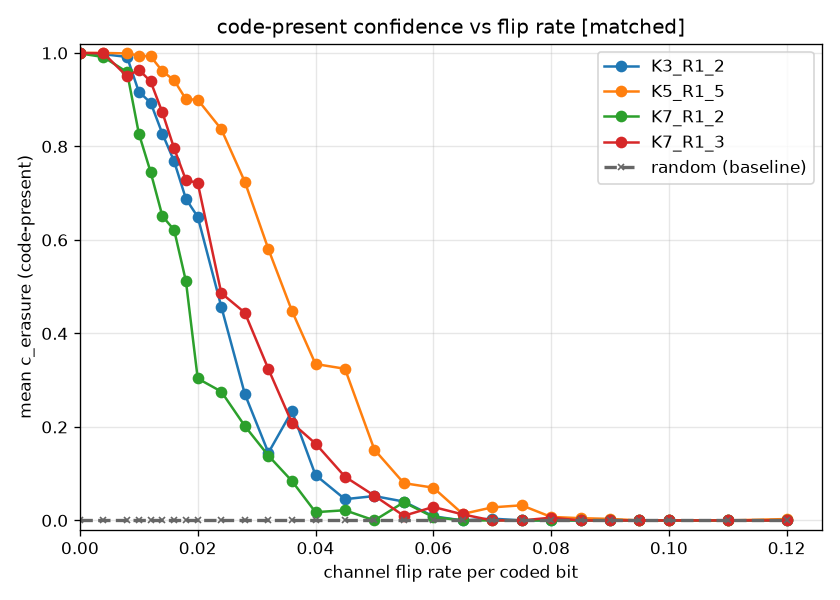 |
| insert | 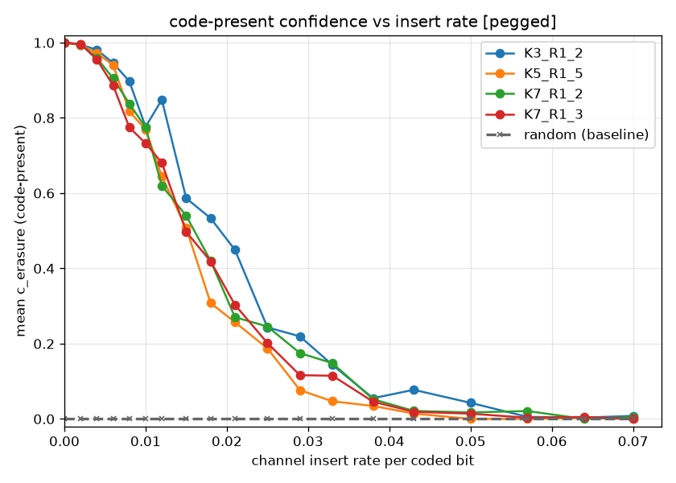 | 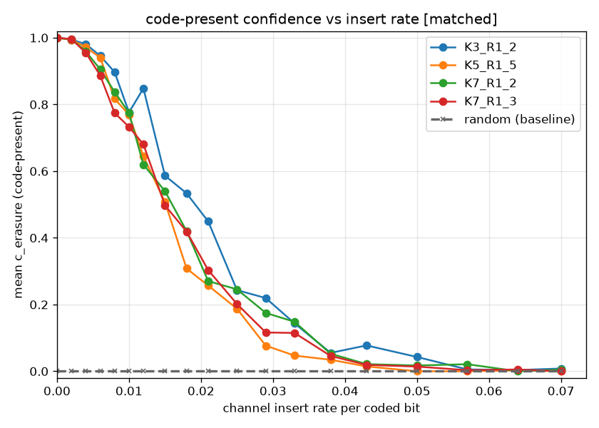 |
| delete | 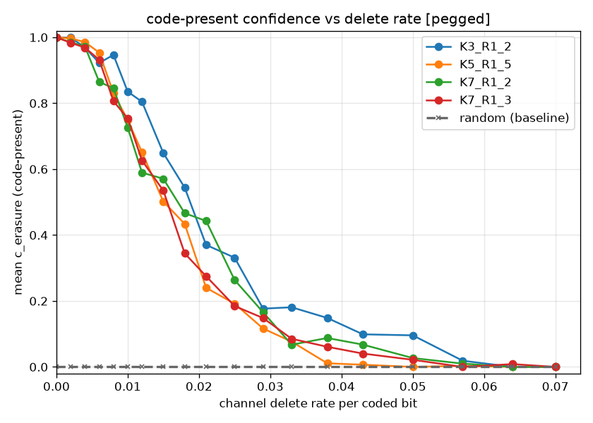 | 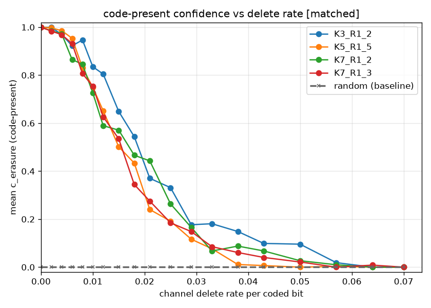 |
| erase  | 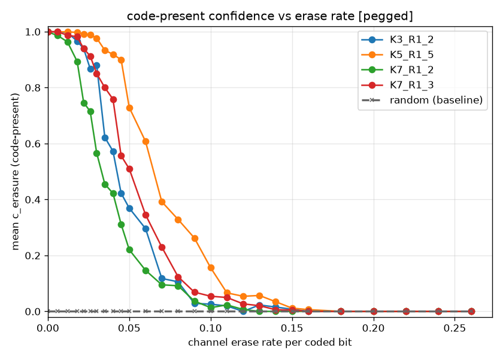 |  |

### No-code confidence (`c_absent`)

Where the variation bites. Under **pegged** the random baseline is flat (fixed
model); under **matched** the flip and erase baselines **decay** as the model expects
more corruption — the calibration that keeps a noisy channel from being wrongly
declared code-free. Insert/delete baselines stay flat in both (indels don't damp).

| axis | pegged | matched |
|---|---|---|
| flip   | 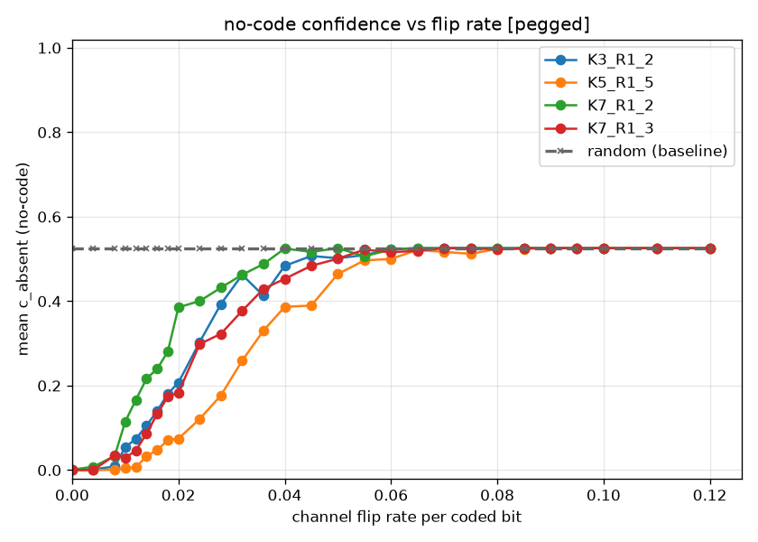 | 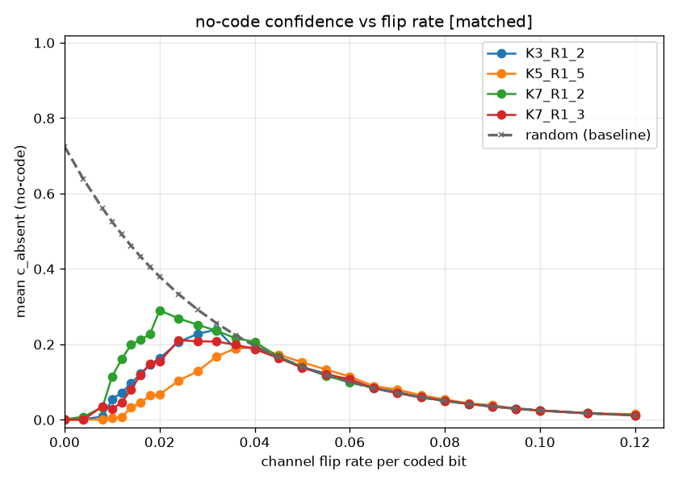 |
| insert | 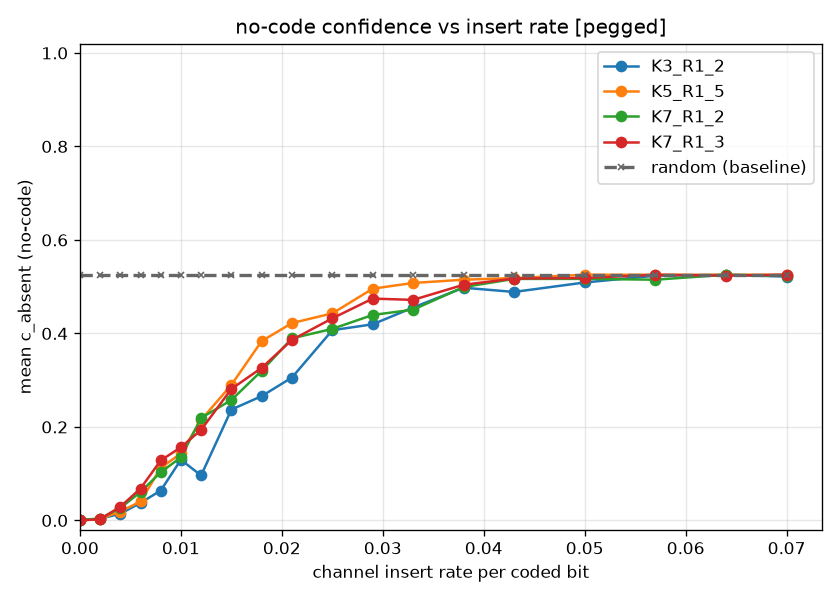 | 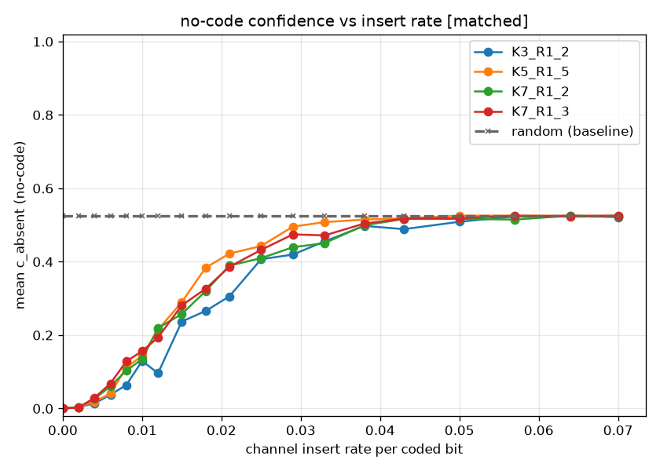 |
| delete | 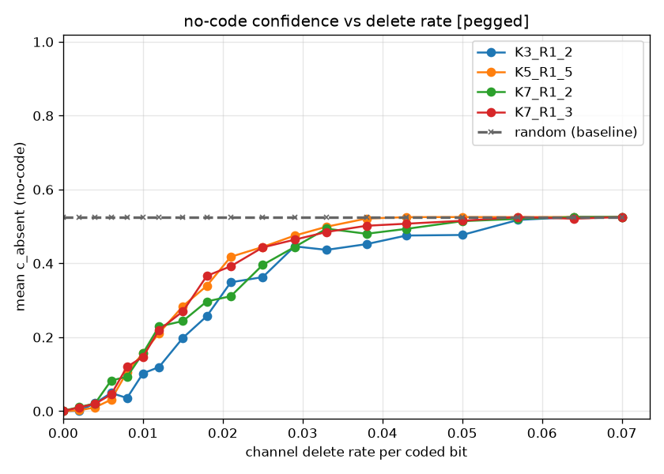 | 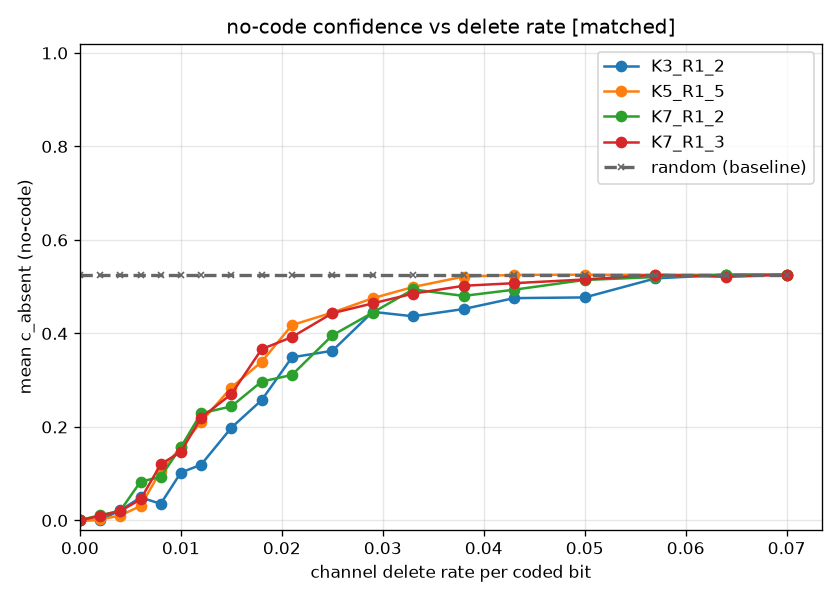 |
| erase  | 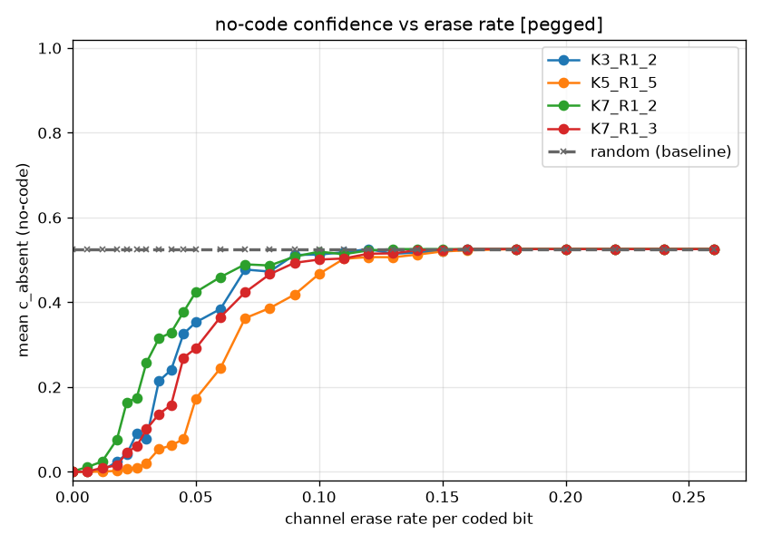 | 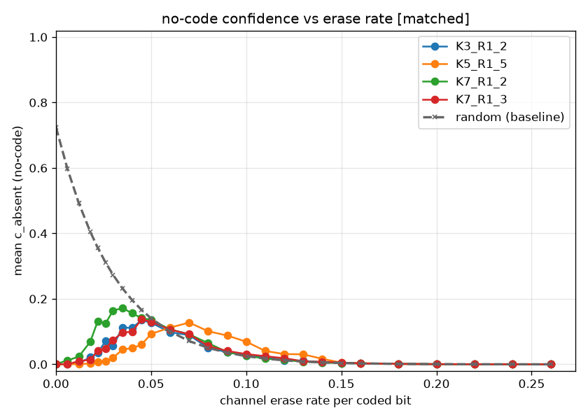 |

## Iterating

The engine constants worth sweeping live in `src/cc/detect_clean/decode.c`
(`DET_W`, `DET_STEP`, `DET_MARGIN`, `DET_SMAX`). Edit, rebuild the target, re-run —
the curves move with them. Retune the channel sweep in `rate_grids.txt` (read at
startup) to zoom a knee without recompiling. Compare against
[detect_noisy](../detect_noisy/METRICS.md), whose bias method pushes every knee
substantially further out at a ~64 KB / heavier-compute cost.
