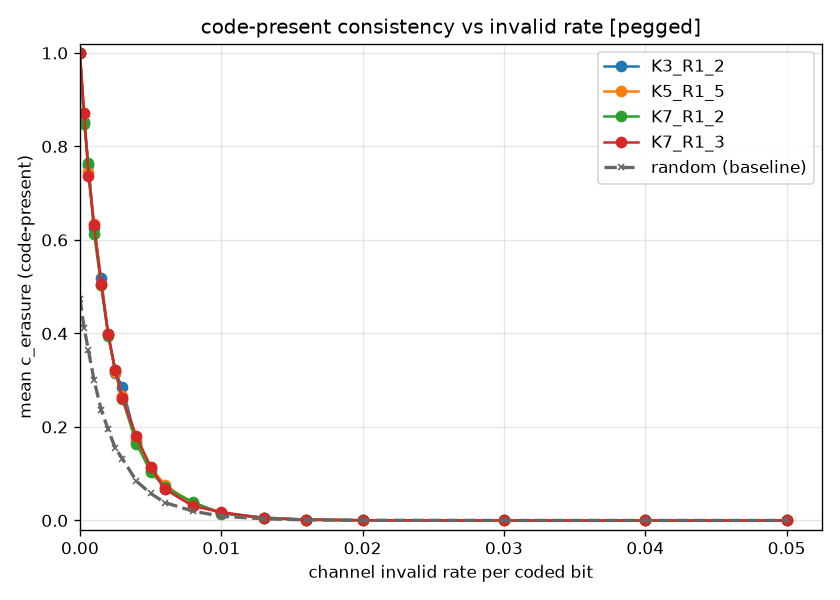
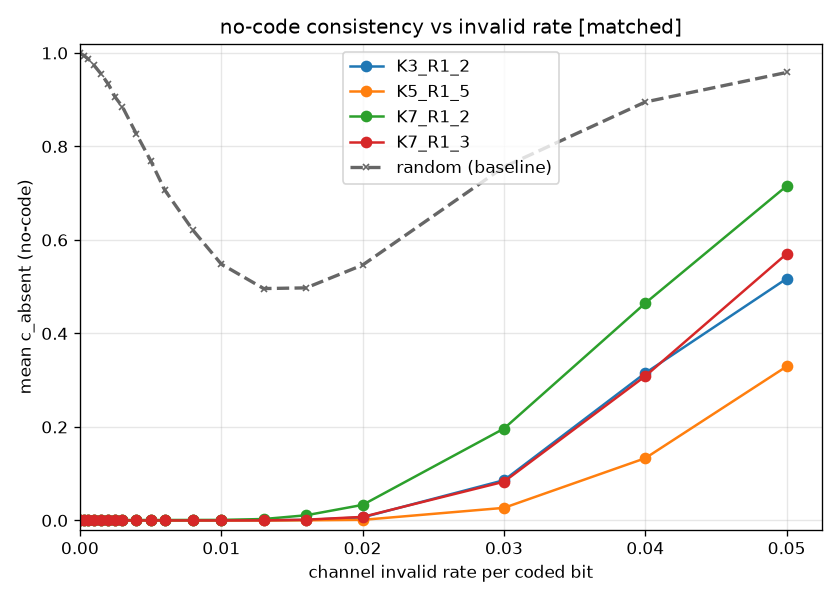

# detect_clean metrics

`metrics/detect_clean/dt_detect_clean_metrics.c` measures the **detect_clean** blind
code-presence detector ([doc](../../doc/cc/detect_clean.md)) — exact GF(2)
sliding-window rank deficiency — across the channel's flip / insert / delete / erase /
invalid axes, for each standard code. It is the detect counterpart of the FEC harnesses (same Monte-Carlo
framework, same `[trials] [info_bits] [seed] [variation] [grids]` CLI), but
detect_clean does not recover bits, so the metrics are detection consistency rather
than edit distance.

> [!NOTE]
> The committed CSVs and plots are the **full sweep** (`40 6000 0xC0FFEE`) over the
> shipped `rate_grids.txt`. For fast iteration on the grids, a coarse pass (e.g.
> `4 2500`) regenerates everything in seconds.

## What is measured

detect_clean answers "is a convolutional code present?". For each point we run **two**
streams through the channel — a **coded** one and a same-length **pure random** one —
and average each of the detector's two consistency reads over the stream interior
(the head/tail no-evidence transient is trimmed):

- **present** (`c_erasure`) — consistency with a code present. ~1 on coded; on random
  it depends on the model (~0 under a clean model, lifted when noise is expected).
- **absent** (`c_absent`) — consistency with random, **model-independent**. ~0 on
  coded (structure contradicts random), ~1 on random.

Emitting the random stream's means alongside the coded ones gives every plot a
pure-random **baseline**: detection works to the extent the coded curves stand clear
of it. Each axis (flip / insert / delete / erase / invalid) is swept independently.

The **invalid** axis is different in kind. It marks coded bits `DT_INVALID` — a symbol
no single code could emit at that spot — and detect reads invalid *placement* as
present-axis evidence. So rising invalid rate **collapses `c_erasure`** (random-placed
invalids land as un-encodable singletons), while `c_absent` is left to register whatever
structure survives. The damping has no model knob, so **pegged and matched coincide** on
this axis.

## Variations (the decoder's channel model)

The detector takes a channel model, selected by a variation — the **parameterization
axis**:

- **pegged** (`untuned/`) — model fixed at a flat 1% on every impairment, whatever
  the channel does.
- **matched** (`tuned/`) — the swept impairment's model rate tracks the channel; the
  others stay at the 1% floor.

The model only calibrates **`c_erasure`** (the code-present read): detect_clean **holds
it up** by `1 − (1 − p)^W` when it expects flips/overwrites — a full-rank window could
still be a real code whose parity those flips broke. So **matched FLIP and ERASE**
sweeps **lift the `c_erasure` random baseline** as the rate climbs (an expected-noisy
channel can't rule a code out, even on random-looking data), while **`c_absent` is
identical across variations** — an unstructured window fits the random model whatever
you expected, a model-independent read — and the **INSERT/DELETE** axes barely move it
(indels don't feed detectability).

## Running

```sh
# Build the harness (off by default).
cmake -S . -B build -DDRIFTY_BUILD_BENCH=ON
cmake --build build --target dt_detect_clean_metrics

# Full sweep (what is committed):
build/metrics/detect_clean/dt_detect_clean_metrics 40 6000 0xC0FFEE pegged  > metrics/detect_clean/untuned/metrics.csv
build/metrics/detect_clean/dt_detect_clean_metrics 40 6000 0xC0FFEE matched > metrics/detect_clean/tuned/metrics.csv

# Coarse pass (fast, for iterating on the grids):
build/metrics/detect_clean/dt_detect_clean_metrics 4 2500 0xC0FFEE pegged  > metrics/detect_clean/untuned/metrics.csv
build/metrics/detect_clean/dt_detect_clean_metrics 4 2500 0xC0FFEE matched > metrics/detect_clean/tuned/metrics.csv

# Plot both consistency reads (with the random baseline) into each variation's plots/.
python3 -m venv .venv && .venv/bin/pip install matplotlib   # once
.venv/bin/python metrics/detect_clean/plot_metrics.py metrics/detect_clean/untuned/metrics.csv -o metrics/detect_clean/untuned/plots/
.venv/bin/python metrics/detect_clean/plot_metrics.py metrics/detect_clean/tuned/metrics.csv   -o metrics/detect_clean/tuned/plots/
```

Every run is reproducible from its `seed` (each point owns a derived PRNG stream, so
the sweep fans out over OpenMP without changing the numbers). The per-axis rate grids
are read from `rate_grids.txt` (or a 5th-argument path), so a sweep retunes without
recompiling. CSV columns: `code, variation, axis, rate, dec_p_flip, dec_p_ins,
dec_p_del, dec_p_ovr_erase, trials, coded_present, coded_absent, random_present,
random_absent` (the `dec_*` columns record the model each point ran with).

## Reading the plots

One figure per (metric, axis): a solid curve per code (the coded value) and a dashed
**random baseline**. **Read detection on the `c_absent` plots** — that axis ignores
the channel model, so the random baseline sits pinned at the ceiling (1.0) and the
coded curves rise to meet it as noise destroys the structure; the coded-to-ceiling
gap is the detection margin. The `c_erasure` plots instead show the *model
calibration* (below). detect_clean's structure shows clearly only at low rates (exact
parity): on the `c_absent` plots the coded curves start climbing toward the ceiling
past ~1 % flips/indels and ~2 % erasures.

The **invalid** axis is the exception to "read it on `c_absent`": there the signal is
the **`c_erasure` collapse** itself (invalids are present-axis evidence), read directly
off the present plot, and pegged ≡ matched (no model knob).

### Code-present consistency (`c_erasure`)

**Where the variation bites.** Coded stays high; the **random baseline is lifted by
the model** — flat at ~0.47 under **pegged** (a constant 1 % expectation), and under
**matched** rising from ~0.28 (clean) toward 1.0 as the swept FLIP/ERASE rate climbs:
an expected-flips channel can't rule a code out, so even random-looking data keeps
code-present consistency, and at high noise the coded curves and the baseline
**converge** near 1 (neither rules out a code). INSERT/DELETE barely move the baseline
(indels don't feed detectability).

| axis | pegged | matched |
|---|---|---|
| flip   |  |  |
| insert |  |  |
| delete |  |  |
| erase  |  |  |
| invalid |  |  |

On the **invalid** axis `c_erasure` *is* the detection read (not the baseline story): the
coded curve **collapses** from 1 toward 0 within a percent or so as random-placed
invalids accumulate — each lone invalid is un-encodable, so a handful per window crushes
the code-present consistency — and the two columns are identical (the invalid penalty has
no model knob). The random baseline starts at the model floor and falls alongside it.

### No-code consistency (`c_absent`)

**The detection envelope — model-independent** (pegged and matched are identical; the
model never touches this axis). The random baseline is pinned at the ceiling (1.0);
the coded curves rise from ~0 to meet it as noise destroys the structure. The knee
(coded ≈ 0.5, half the structure gone) is ~2 % flips for the rate-½ codes, later for
the more-redundant ones; the coded-to-ceiling gap is the readable detection margin. On
the **invalid** axis this read lags the present one: coded `c_absent` holds near 0 while
the rank deficiency survives and only climbs once invalids grow dense enough (a few
percent) to wreck it — so invalids are detected on the present plot, not here.

| axis | pegged | matched |
|---|---|---|
| flip   |  |  |
| insert |  |  |
| delete |  |  |
| erase  |  |  |
| invalid |  |  |

## Iterating

The engine constants worth sweeping live in `src/cc/detect_clean/decode.c`
(`DET_W`, `DET_STEP`, `DET_MARGIN`, `DET_SMAX`). Edit, rebuild the target, re-run —
the curves move with them. Retune the channel sweep in `rate_grids.txt` (read at
startup) to zoom a knee without recompiling. Compare against
[detect_noisy](../detect_noisy/METRICS.md), whose bias method pushes the flip and
erasure knees substantially further out (indels comparable) at a ~64 KB /
heavier-compute cost.
