# detect_noisy metrics

`metrics/detect_noisy/dt_detect_noisy_metrics.c` measures the **detect_noisy** blind
code-presence detector ([doc](../../doc/cc/detect_noisy.md)) — parity-check **bias**
scored by a fast Walsh–Hadamard transform — across the channel's flip / insert / delete
/ erase / invalid axes, for each standard code. It shares the framework and CLI of the FEC harnesses, but
detect_noisy does not recover bits, so the metrics are detection consistency rather
than edit distance. It is the noise-tolerant sibling of
[detect_clean](../detect_clean/METRICS.md): same metrics and plots, with the flip
and erasure knees pushed substantially further out (indels comparable) at a ~64 KB /
heavier-compute cost.

> [!NOTE]
> The committed CSVs and plots are the **full sweep** (`40 6000 0xC0FFEE`) over the
> shipped `rate_grids.txt`. For fast iteration on the grids, a coarse pass (e.g.
> `4 2500`) regenerates everything in seconds.

## What is measured

detect_noisy answers "is a convolutional code present?". For each point we run **two**
streams through the channel — a **coded** one and a same-length **pure random** one —
and average each of the detector's two consistency reads over the stream interior
(the head/tail no-evidence transient is trimmed):

- **present** (`c_erasure`) — consistency with a code present. ~1 on coded; on random
  it depends on the model (~0 under a clean model, lifted when noise is expected).
- **absent** (`c_absent`) — consistency with random, **model-independent**. ~0 on
  coded (structure contradicts random), ~1 on random.

Emitting the random stream's means alongside the coded ones gives every plot a
pure-random **baseline**: detection works to the extent the coded curves stand clear
of it. Each axis (flip / insert / delete / erase / invalid) is swept independently.

The **invalid** axis is different in kind. It marks coded bits `DT_INVALID` — a symbol
no single code could emit at that spot — read as **two-sided evidence**: rising invalid
rate both **collapses `c_erasure`** (un-encodable singletons contradict a code) and
**lifts `c_absent`** (they favor no-code), driving coded from `(1, 0)` to `(0, 1)` — even
faster than detect_clean (the larger window catches more invalids per scored region). On
a random stream `c_absent` stays at its ceiling. The evidence has no model knob, so
**pegged and matched coincide** on this axis.

## Variations (the decoder's channel model)

The detector takes a channel model, selected by a variation — the **parameterization
axis**:

- **pegged** (`untuned/`) — model fixed at a flat 1% on every impairment, whatever
  the channel does.
- **matched** (`tuned/`) — the swept impairment's model rate tracks the channel; the
  others stay at the 1% floor.

The model only calibrates **`c_erasure`** (the code-present read): detect_noisy **holds
it up** by `1 − (1 − 2p)^W_ref` when it expects flips/overwrites — a no-peak window
could still be a real code whose parity bias those flips eroded into the floor. So
**matched FLIP and ERASE** sweeps **lift the `c_erasure` random baseline** as the rate
climbs (an expected-noisy channel can't rule a code out, even on random-looking data),
while **`c_absent` is identical across variations** — an observed peak is what
contradicts random and noise never manufactures one, a model-independent read — and
the **INSERT/DELETE** axes barely move it (indels don't feed detectability).

## Running

```sh
# Build the harness (off by default).
cmake -S . -B build -DDRIFTY_BUILD_BENCH=ON
cmake --build build --target dt_detect_noisy_metrics

# Full sweep (what is committed):
build/metrics/detect_noisy/dt_detect_noisy_metrics 40 6000 0xC0FFEE pegged  > metrics/detect_noisy/untuned/metrics.csv
build/metrics/detect_noisy/dt_detect_noisy_metrics 40 6000 0xC0FFEE matched > metrics/detect_noisy/tuned/metrics.csv

# Coarse pass (fast, for iterating on the grids):
build/metrics/detect_noisy/dt_detect_noisy_metrics 4 2500 0xC0FFEE pegged  > metrics/detect_noisy/untuned/metrics.csv
build/metrics/detect_noisy/dt_detect_noisy_metrics 4 2500 0xC0FFEE matched > metrics/detect_noisy/tuned/metrics.csv

# Plot both consistency reads (with the random baseline) into each variation's plots/.
python3 -m venv .venv && .venv/bin/pip install matplotlib   # once
.venv/bin/python metrics/detect_noisy/plot_metrics.py metrics/detect_noisy/untuned/metrics.csv -o metrics/detect_noisy/untuned/plots/
.venv/bin/python metrics/detect_noisy/plot_metrics.py metrics/detect_noisy/tuned/metrics.csv   -o metrics/detect_noisy/tuned/plots/
```

Every run is reproducible from its `seed` (each point owns a derived PRNG stream, so
the sweep fans out over OpenMP without changing the numbers). The per-axis rate grids
are read from `rate_grids.txt` (or a 5th-argument path), so a sweep retunes without
recompiling. CSV columns: `code, variation, axis, rate, dec_p_flip, dec_p_ins,
dec_p_del, dec_p_ovr_erase, trials, coded_present, coded_absent, random_present,
random_absent` (the `dec_*` columns record the model each point ran with).

## Reading the plots

One figure per (metric, axis): a solid curve per code (the coded value) and a dashed
**random baseline**. **Read detection on the `c_absent` plots** — that axis ignores
the channel model, so the random baseline sits at/near the ceiling (~0.93–1.0; the
small shortfall is the residual bias the FWHT finds on random data) and the coded
curves rise to meet it as noise erodes the bias; the coded-to-ceiling gap is the
detection margin. The `c_erasure` plots show the *model calibration* instead (below).
detect_noisy degrades **gracefully**: on the `c_absent` plots the coded curves climb
toward the ceiling only past ~5–8 % flips, ~2–3 % indels, ~16 % erasures.

The **invalid** axis reads on **both** plots: invalids are two-sided evidence, so the
coded point sweeps from `(1, 0)` to `(0, 1)` — `c_erasure` collapses (not a code) while
`c_absent` rises to the ceiling (favors no-code). The random baseline stays pinned at the
`c_absent` ceiling throughout. pegged ≡ matched (no model knob).

### Code-present consistency (`c_erasure`)

**Where the variation bites.** Coded stays high; the **random baseline is lifted by
the model** — flat at ~0.28 under **pegged** (a constant 1 % expectation), and under
**matched** rising from ~0.16 (clean) toward 1.0 as the swept FLIP/ERASE rate climbs:
an expected-flips channel can't rule a code out, so even random-looking data keeps
code-present consistency, and at high noise coded and the baseline **converge** near 1.
INSERT/DELETE barely move the baseline (indels don't feed detectability).

| axis | pegged | matched |
|---|---|---|
| flip   | 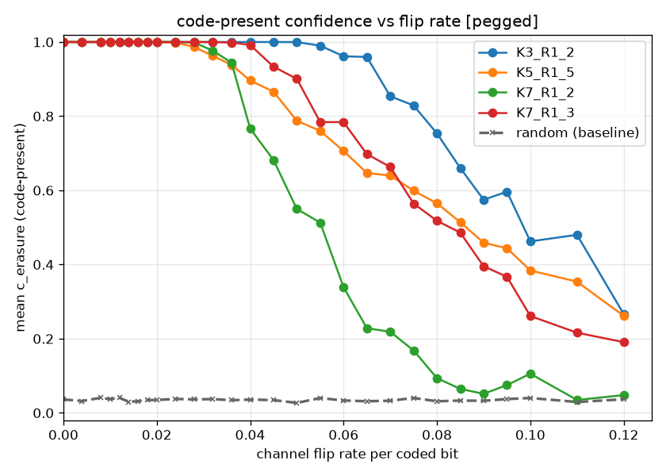 | 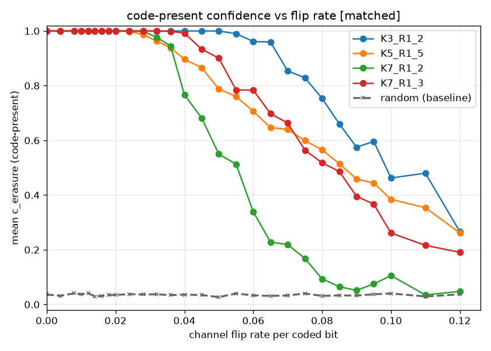 |
| insert | 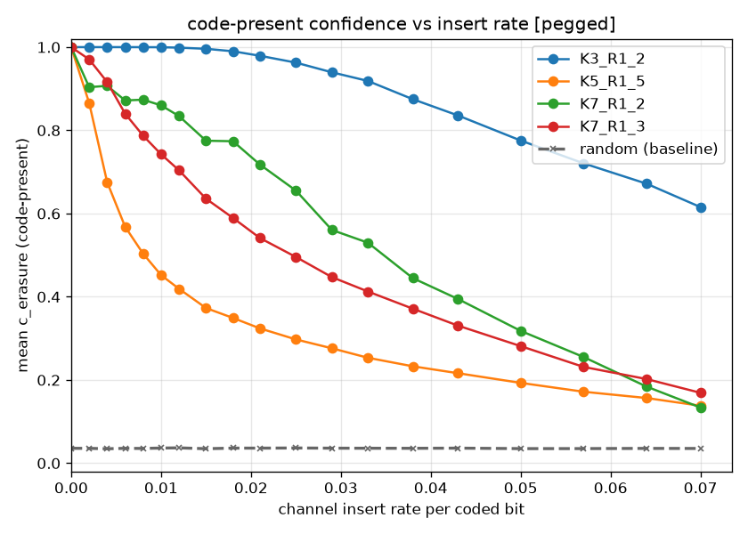 | 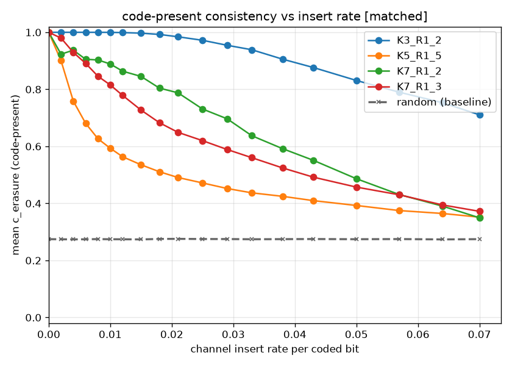 |
| delete | 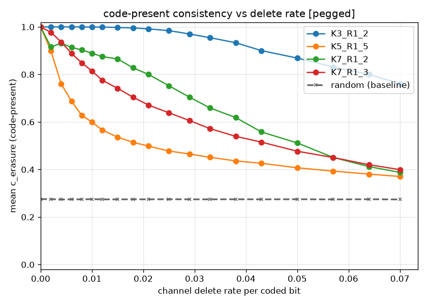 | 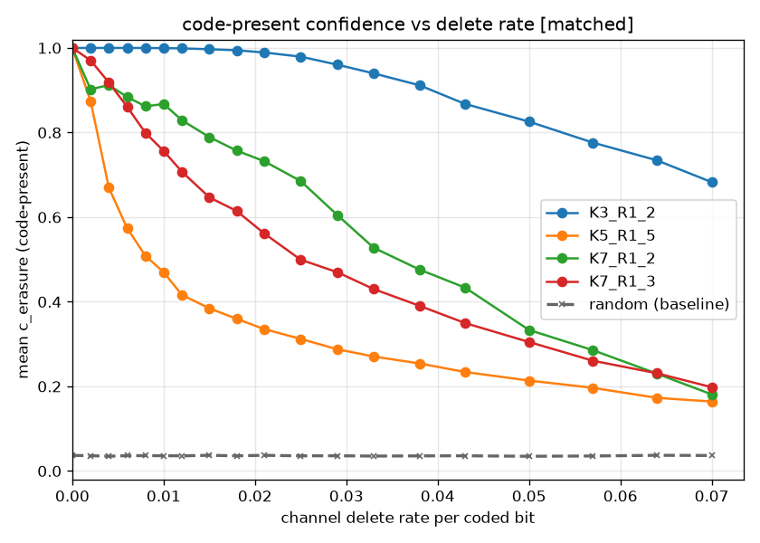 |
| erase  | 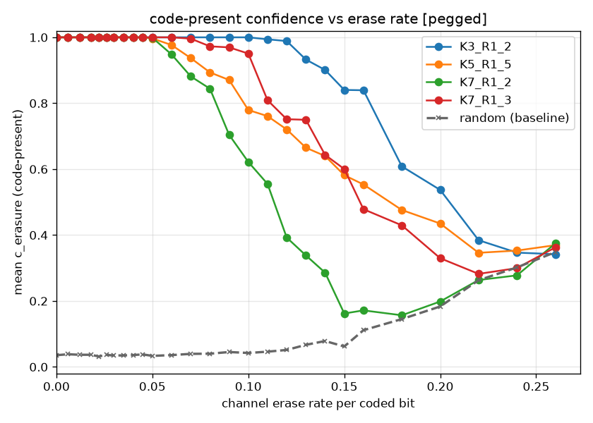 | 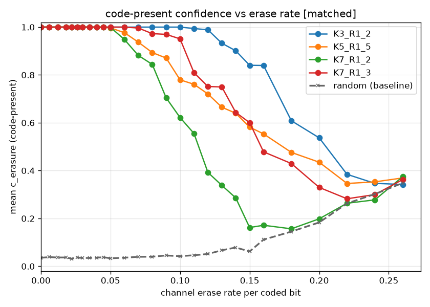 |
| invalid | 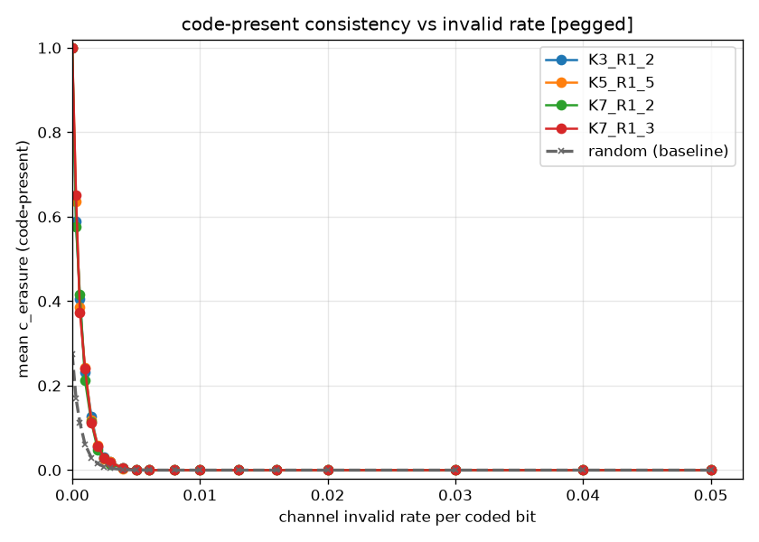 | 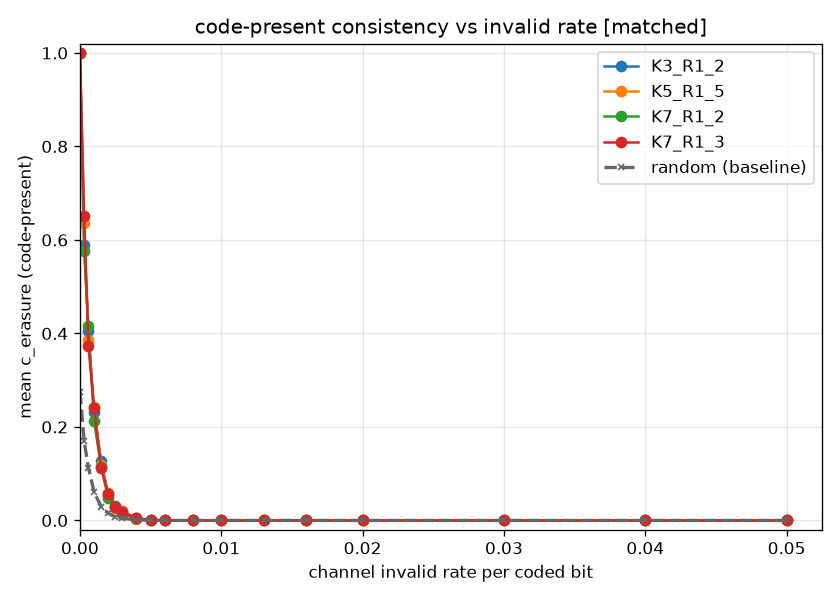 |

On the **invalid** axis the coded `c_erasure` curve **collapses** to ~0 within a few
tenths of a percent (the 1200-bit window catches many invalids, each lone one
un-encodable), faster than detect_clean's, and the two columns are identical (no model
knob). The matching `c_absent` *rise* is in the next section — together the coded point
sweeps from `(1, 0)` to `(0, 1)`: not a code, and the scattered invalids favor no-code.

### No-code consistency (`c_absent`)

**The detection envelope — model-independent** (pegged and matched are identical; the
model never touches this axis). The random baseline sits at/near the ceiling
(~0.93–1.0); the coded curves rise from ~0 to meet it as flips/indels/erasures erode
the bias. The knee (coded ≈ 0.5, half the bias gone) is ~7 % flips for K7-rate-½,
later for the more-redundant codes; the coded-to-ceiling gap is the readable
detection margin. On the **invalid** axis coded `c_absent` **rises** from ~0 to the
ceiling as invalids accumulate — they are two-sided evidence and favor no-code — meeting
the random baseline, which stays at the ceiling throughout.

| axis | pegged | matched |
|---|---|---|
| flip   | 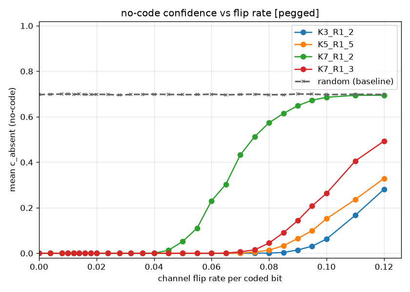 | 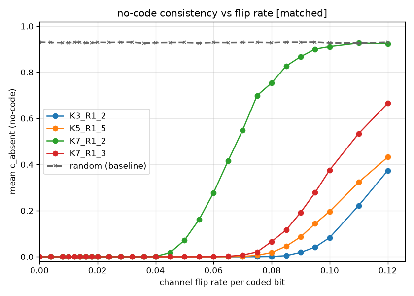 |
| insert | 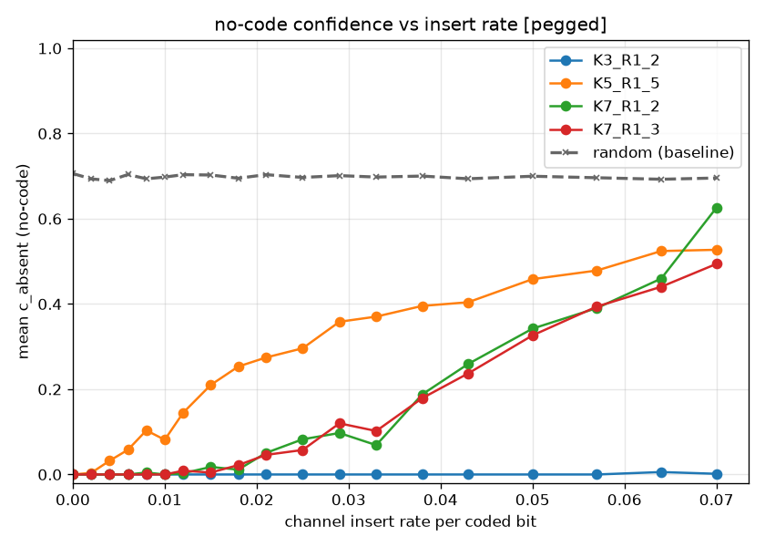 | 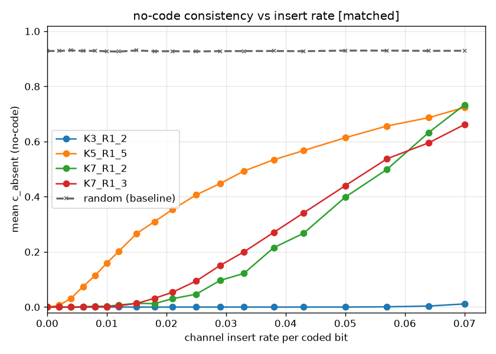 |
| delete | 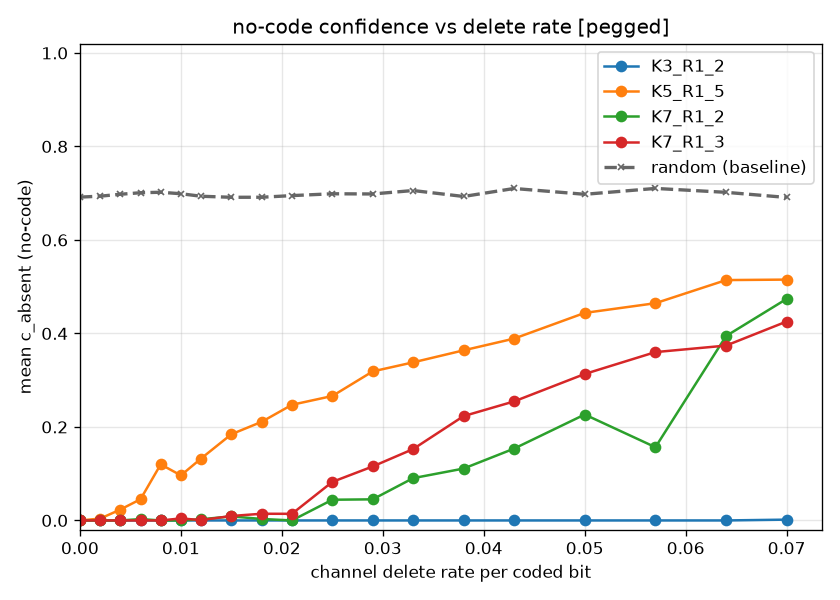 | 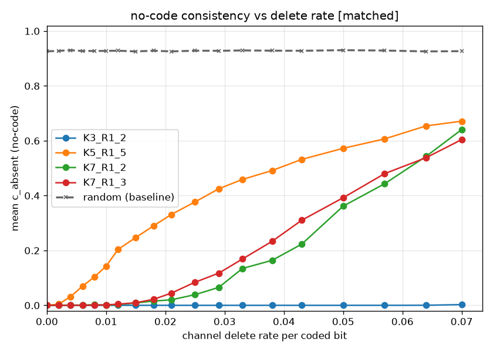 |
| erase  | 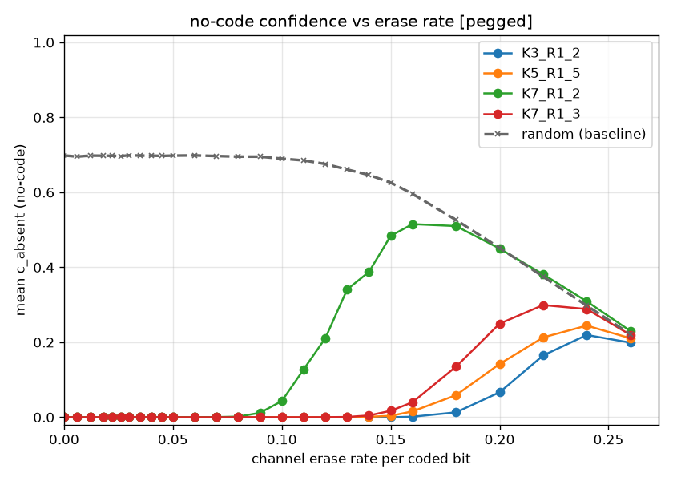 | 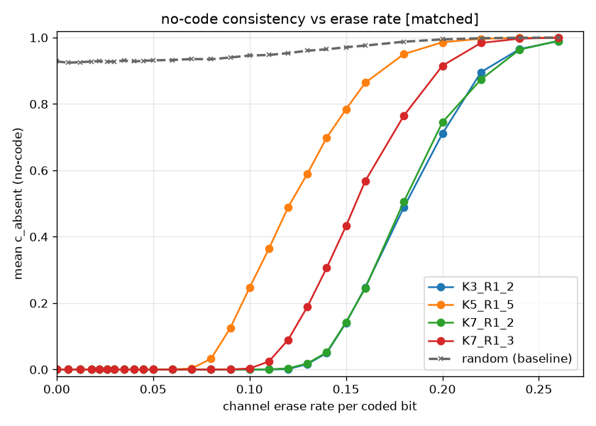 |
| invalid | 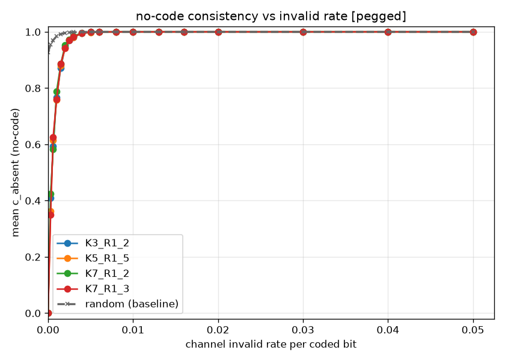 |  |

## Iterating

The engine constants worth sweeping live in `src/cc/detect_noisy/decode.c`
(`DET_LC` — transform order / histogram size, `DET_L` — window, `DET_STEP`,
`DET_K_LOST` — the c_erasure peak-clearance scale, `DET_WREF` — the detectability
weight that lifts the c_erasure random baseline under a noisy model). Edit, rebuild
the target, re-run — the `absent` detection envelope moves with the geometry
(`DET_LC`/`DET_L`/`DET_STEP`), the `present` random-baseline lift with `DET_WREF`, and
the `present` mapping with `DET_K_LOST`. Retune the
channel sweep in `rate_grids.txt` (read at startup) to zoom a knee without
recompiling.
