# vindel metrics

`metrics/vindel/dt_vindel_metrics.c` measures the decoding-mistake rate as a
function of the channel's flip / insert / delete / erase rates, for all four
standard codes, for the **vindel** codec (the ported drift_viterbi algorithm).
It is the vindel counterpart of [../hybrid/METRICS.md](../hybrid/METRICS.md): same
Monte-Carlo framework — random message → encode → channel → stream-decode — and
the same metrics, so the two codecs can be compared curve for curve.

It reports the **normalized edit (Levenshtein) distance** between the decoded
bits and the original message, divided by the number of message bits (after a
warm-up to skip the acquisition transient). Each axis is swept independently with
the other rates at zero, so each curve isolates one impairment.

> Edit distance is the right metric for a channel that inserts and deletes bits:
> a single uncorrected sync slip costs *one* edit, rather than misaligning the
> whole remaining stream the way a position-by-position bit comparison would. A
> clean decode scores 0; total failure approaches ~1 edit per info bit.

> [!NOTE]
> The committed CSVs and the plots below are the full sweep — all three variations,
> 30 trials per point over the shipped `rate_grids.txt`, seed `0xC0FFEE`.

Unlike the hybrid harness, this one drives the **private engine API**
(`vindel/decode.h`) rather than the public archive: the lock metric needs the
decoder's per-bit lock probability, which the public vindel decoder (hard
decision only — vindel has no soft decoder) does not surface. The CMake target
therefore links the engine objects directly and reaches `src/` via `-Isrc`, like
the vindel tests.

The harness runs in three variations (see [Variations](#variations) below), all
measuring decoding performance — `matched`, where the decoder anticipates the
channel, `pegged`, where it does not, and `overmatched`, where the decoder braces
for corruption that never comes (a clean channel). They write to
`metrics/vindel/tuned/`, `metrics/vindel/untuned/`, and
`metrics/vindel/overmatched/`.

```sh
# Build the harness (off by default) and run each variation to its own CSV.
cmake -S . -B build -DDRIFTY_BUILD_BENCH=ON
cmake --build build --target dt_vindel_metrics
# dt_vindel_metrics <trials> <info_bits> <seed> <variation> <rate_grids_file>
#   variation = pegged|matched|overmatched   (defaults: 50 1000 0xC0FFEE pegged)
#   rate_grids_file defaults to metrics/vindel/rate_grids.txt (so run from the repo root)
build/metrics/vindel/dt_vindel_metrics 30 4000 0xC0FFEE matched     > metrics/vindel/tuned/metrics.csv
build/metrics/vindel/dt_vindel_metrics 30 4000 0xC0FFEE pegged      > metrics/vindel/untuned/metrics.csv
build/metrics/vindel/dt_vindel_metrics 30 4000 0xC0FFEE overmatched > metrics/vindel/overmatched/metrics.csv

# Plot the metrics each CSV carries (one curve per code). Needs matplotlib:
python3 -m venv .venv && .venv/bin/pip install matplotlib
.venv/bin/python metrics/vindel/plot_metrics.py metrics/vindel/tuned/metrics.csv   -o metrics/vindel/tuned/plots/   --match metrics/vindel/untuned/metrics.csv
.venv/bin/python metrics/vindel/plot_metrics.py metrics/vindel/untuned/metrics.csv -o metrics/vindel/untuned/plots/ --match metrics/vindel/tuned/metrics.csv
.venv/bin/python metrics/vindel/plot_metrics.py metrics/vindel/overmatched/metrics.csv -o metrics/vindel/overmatched/plots/
```

All share a `seed`, so every run is reproducible. The corrupted-channel
variations (`pegged`, `matched`) also see the *same* channel realizations at a
given (code, axis, rate); `overmatched`'s channel is clean, so there its seed
only drives the message.

The sweep's rate grids are not compiled in: `dt_vindel_metrics` reads them at
startup from a plain-text file (`metrics/vindel/rate_grids.txt` by default, or a
path passed as the 5th argument). Each line is
`<variation> <metric> <axis>  <rate> <rate> ...` (`#` begins a comment), so you
can retune which rates a curve samples by editing that file and re-running, with
no rebuild. The sweep is fanned out across cores with OpenMP when available, and
each point owns a seeded PRNG stream, so a given `seed` reproduces every row's
values exactly regardless of thread count.

The CSV columns are `code, metric, axis, rate, dec_p_sub, dec_p_ins, dec_p_del,
dec_p_erase, decision_depth, max_drift, trials, ref_bits, edit_distance,
edit_rate, lock_bits, mean_lock` — the `dec_p_*` columns record the vindel
channel-model probabilities the decoder was built with at that point (see
[Variations](#variations)). The plotter reads each CSV by column name, so column
order is all that matters.

By default the plotter writes, per axis, three metrics:

- **edit** — edit distance per info bit (mistakes per bit).
- **runlen** — mean run length between edits (`1 / edit_rate`): the average bits
  that get through between mistakes. Points where no edits were observed are
  dropped (the value there is only a lower bound, not infinity).
- **lock** — mean lock probability (0–1): the decoder's own running confidence
  that it is tracking a valid coded stream, averaged over the kept bits.

## Variations

The variations differ in the decoder's channel model — the
`dt_cc_vindel_stream_params` probabilities (`p_sub`, `p_ins`, `p_del`, `p_erase`) it
is built with — and so each samples its **own rate grid**.

- **untuned** (`metrics/vindel/untuned/`, the `pegged` model) — every impairment
  probability is pegged at a flat 1%, with drift tracking always on. The decoder
  is never told what the channel is doing, so as a rate climbs it meets something
  increasingly unexpected. Shows how the decoder handles **channels it cannot
  anticipate**.
- **tuned** (`metrics/vindel/tuned/`, the `matched` model) — the active
  impairment's probability is set to the swept rate (`p_sub` for flip, `p_ins` /
  `p_del` for indels, `p_erase` for erasures), and drift is tracked only for
  insertions and deletions. The decoder's model matches the channel at every
  point — its best case.
- **overmatched** (`metrics/vindel/overmatched/`, the `overmatched` model) — the
  decoder is built with the *matched* model (it expects the swept rate of
  corruption) but the channel is **clean**. The x-axis is what the decoder
  *expects*, not what it meets, and the curve is the **penalty of over-bracing**
  for trouble that never comes.

For a corrupted channel the matched decoder always does at least as well as the
pegged one. Overmatched is the opposite stress — the same matched model, but
nothing wrong to correct.

## Generated plots

The figures below come from the full sweep described above. In every plot the x-axis is the channel
impairment rate per coded bit and the four curves are the standard codes —
`K3_R1_2`, `K7_R1_2` (rate 1/2), `K7_R1_3` (rate 1/3) and `K5_R1_5` (rate 1/5),
in order of increasing redundancy. Treat the shapes as indicative; the knees and
plateaus will sharpen once the full-resolution sweep is run.

### Edit distance (decoding mistakes per bit)

| Untuned — unanticipated channel | Tuned — anticipated channel |
|---|---|
| 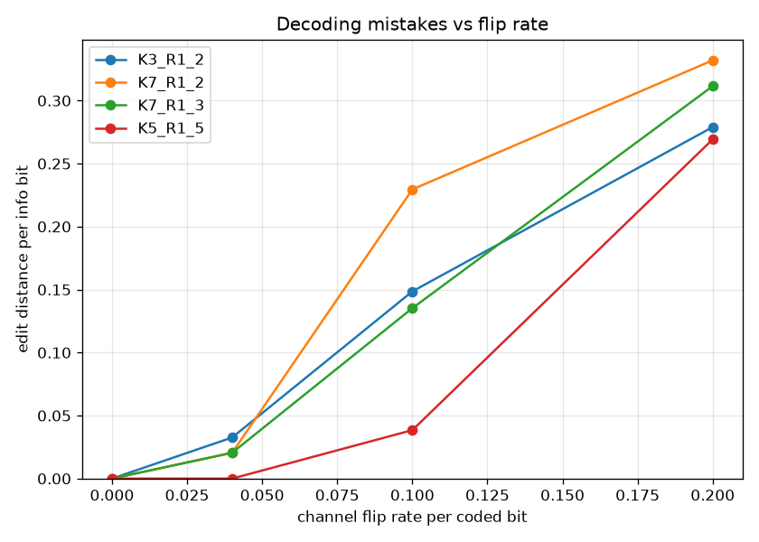 | 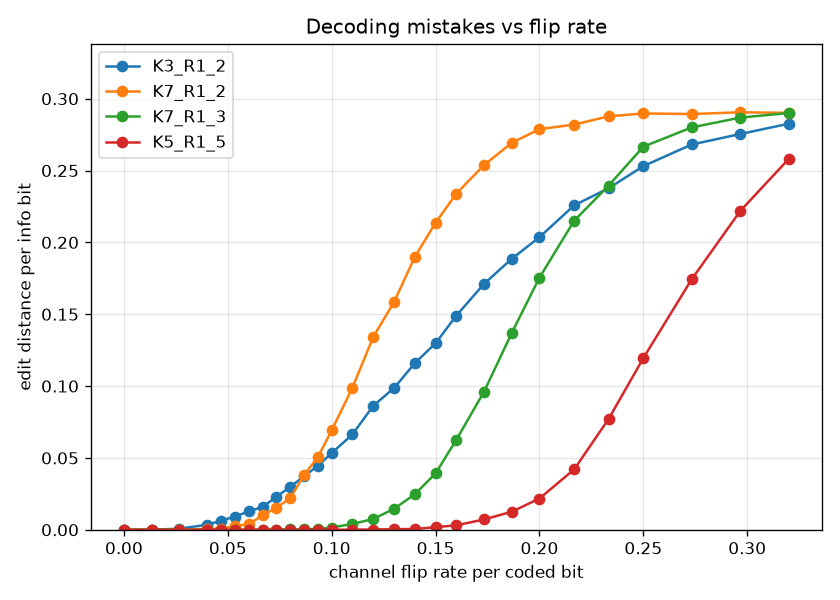 |
| 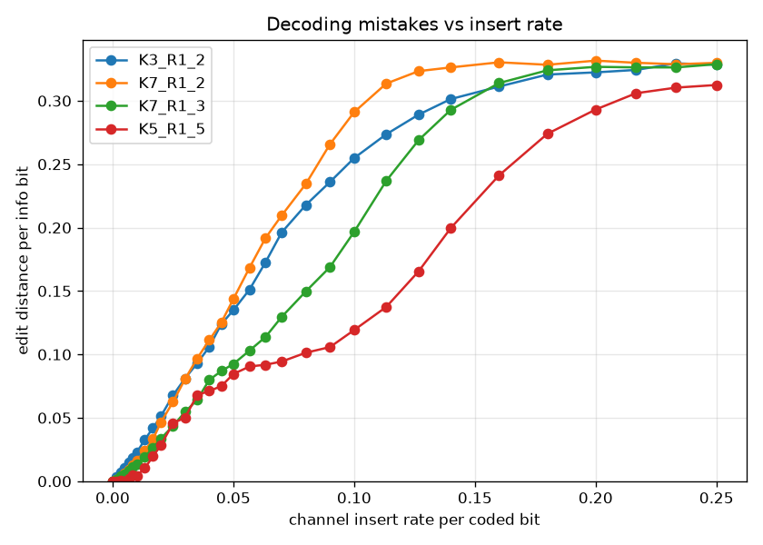 | 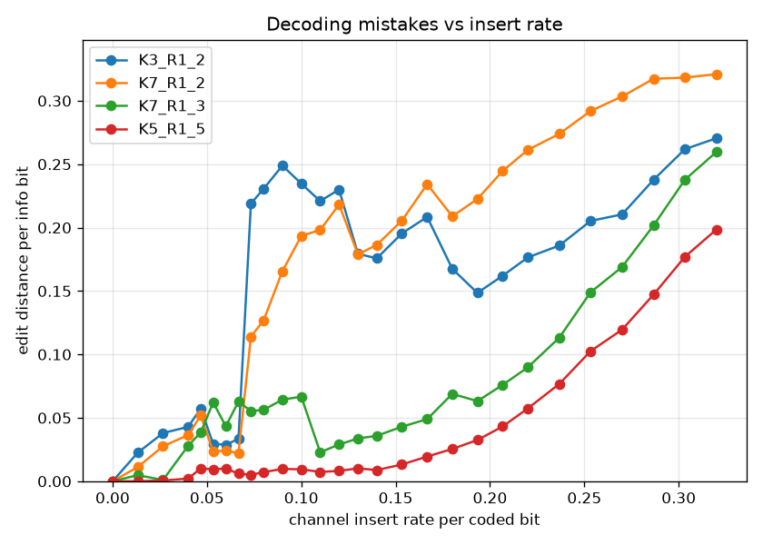 |
| 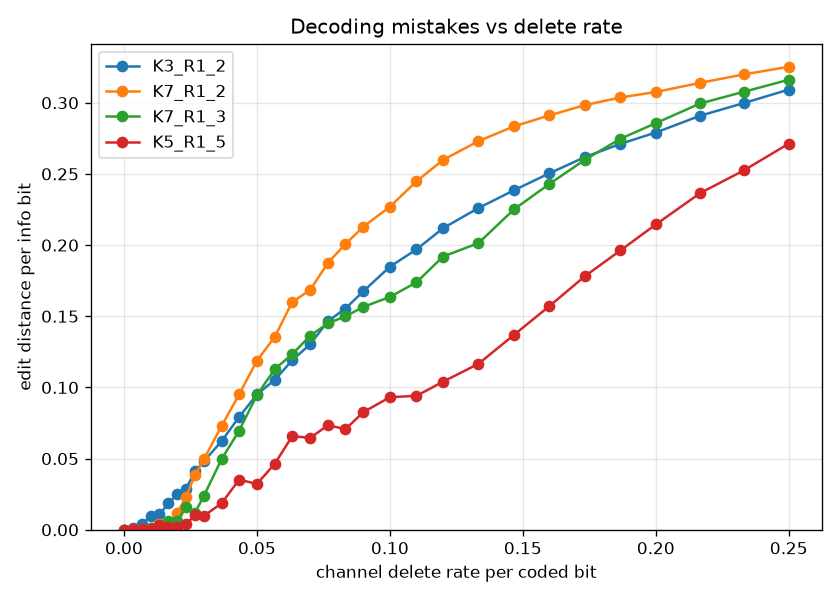 | 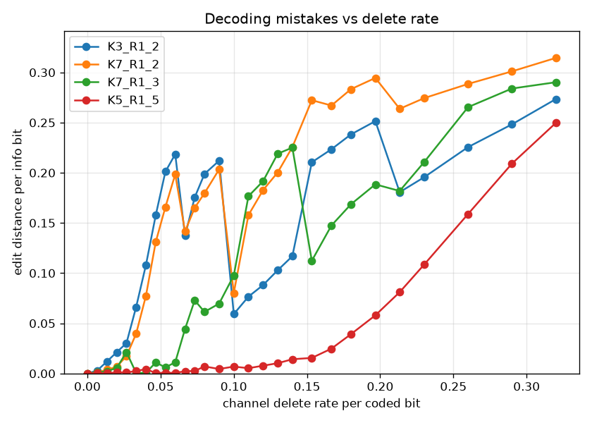 |
| 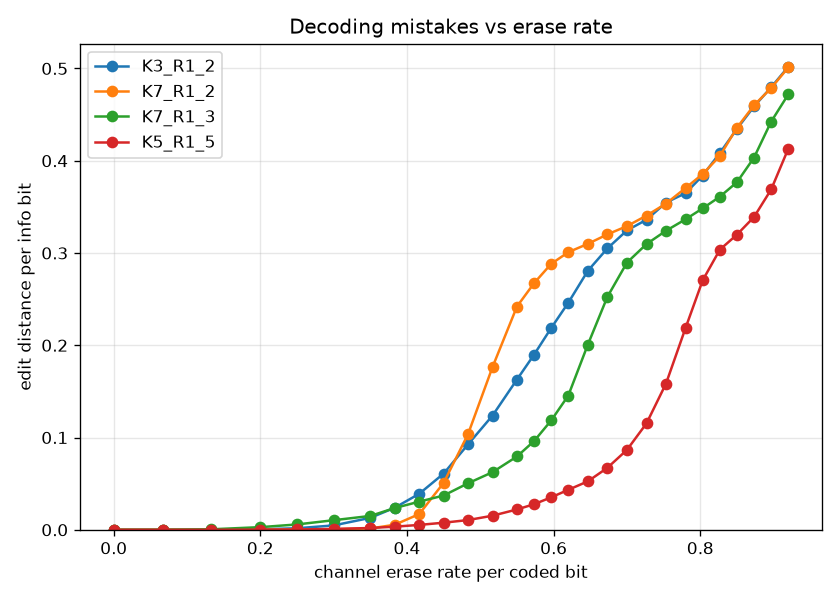 | 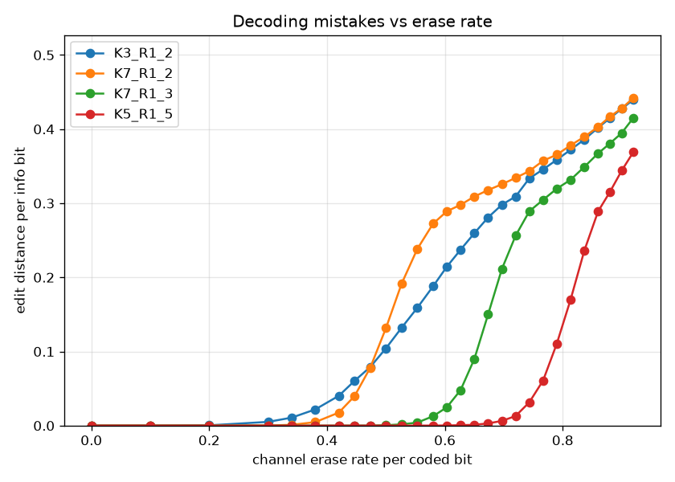 |

### Lock probability

| Untuned — unanticipated channel | Tuned — anticipated channel |
|---|---|
| 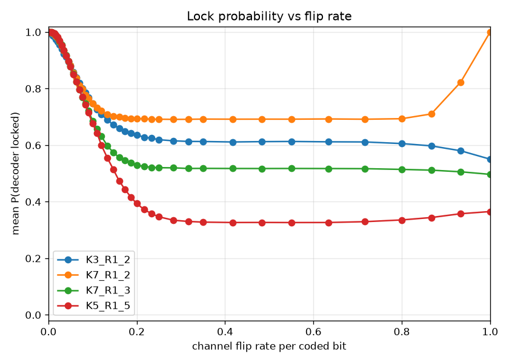 | 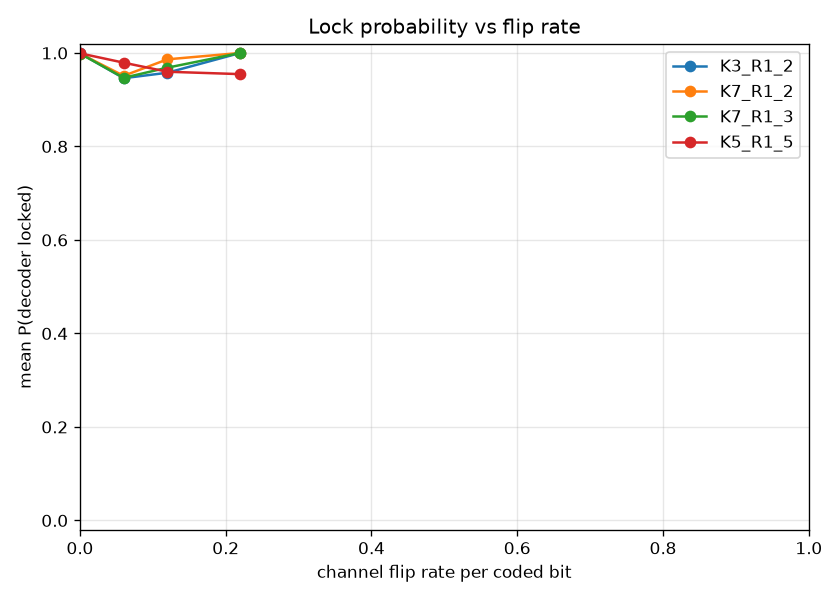 |
| 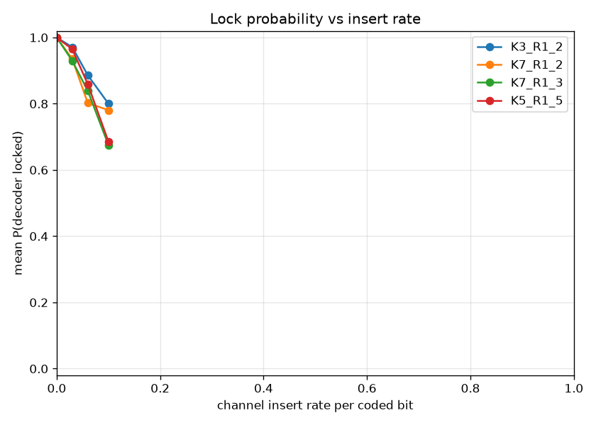 | 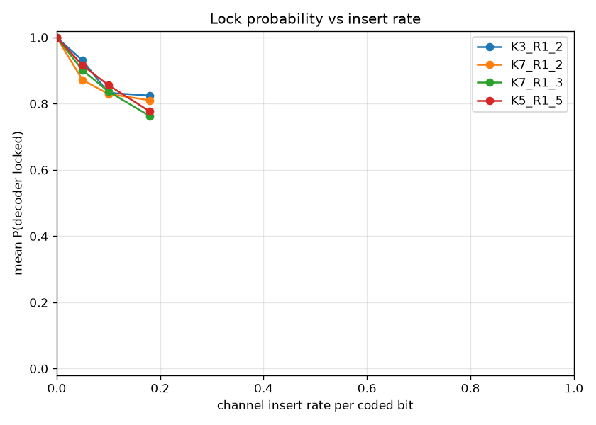 |
| 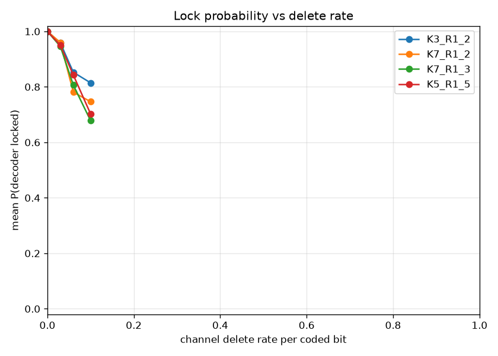 | 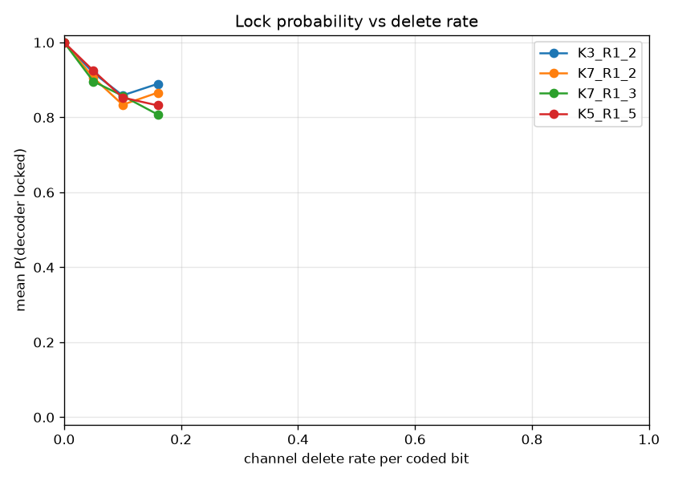 |
| 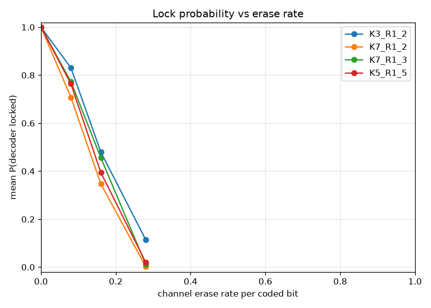 |  |

### Overmatched

| Edit distance per info bit | Lock probability |
|---|---|
| 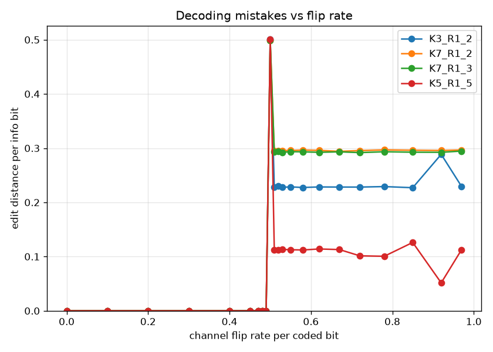 | 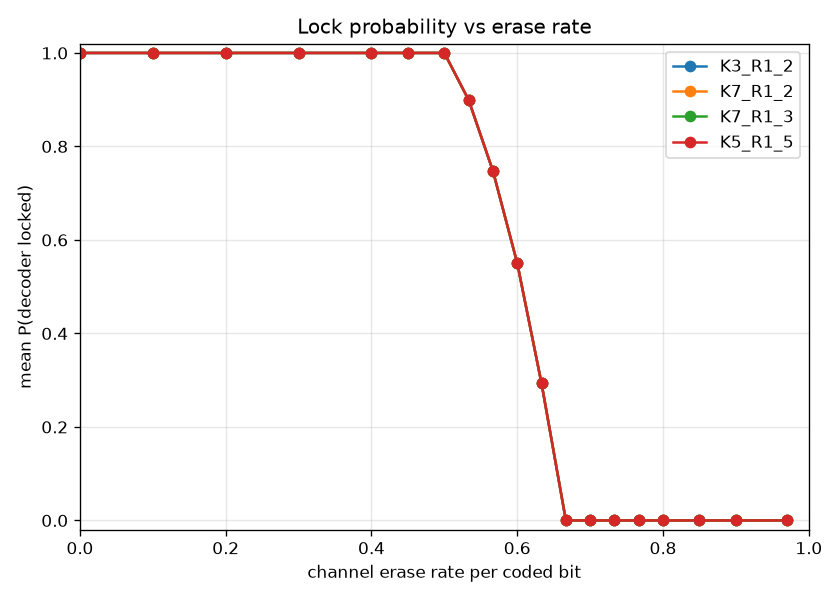 |
