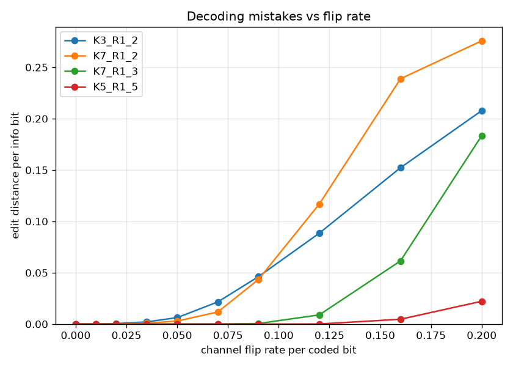
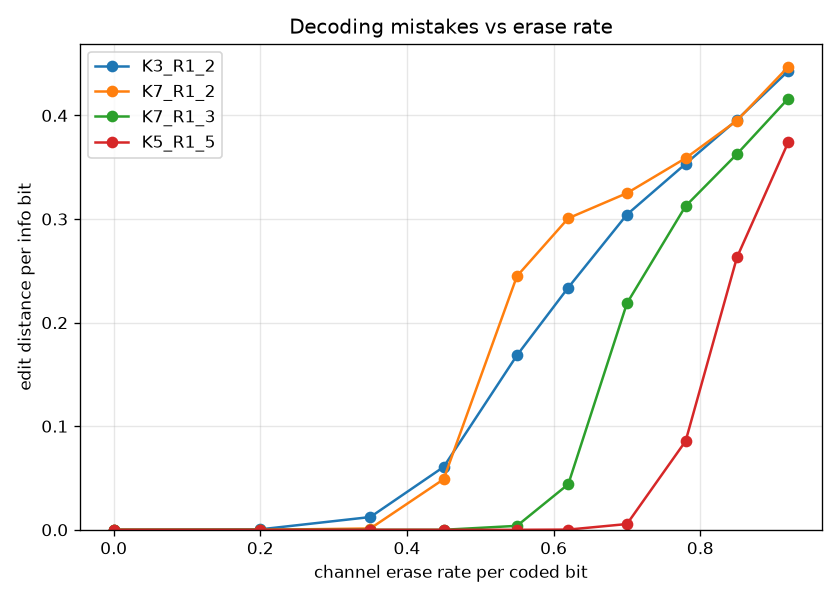
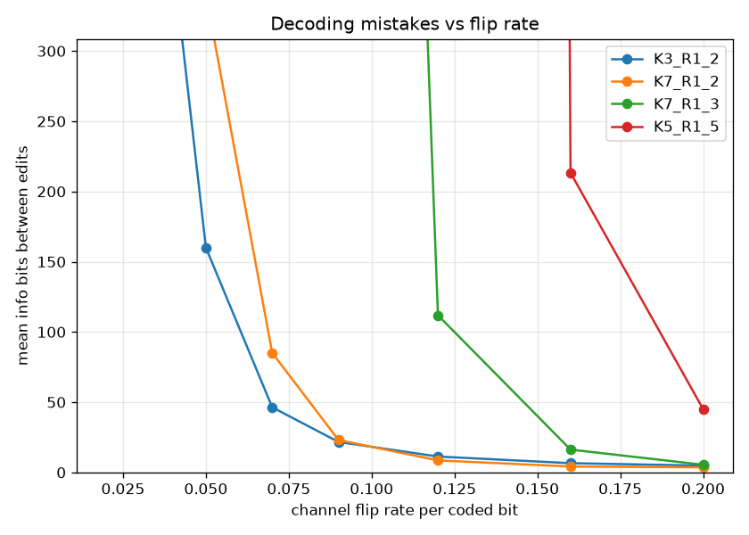
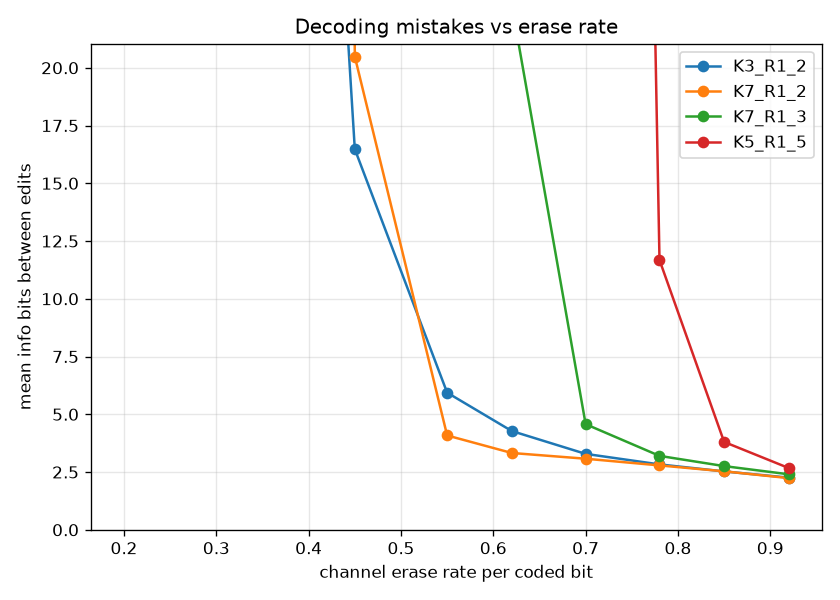

# viterbi metrics

`metrics/viterbi/dt_viterbi_metrics.c` measures the decoding-mistake rate as a
function of the channel's flip and erase rates, for all four standard codes, for
the **viterbi** codec (a plain Viterbi hard-decision decoder). It is the viterbi
counterpart of [../hybrid/METRICS.md](../hybrid/METRICS.md) and
[../vindel/METRICS.md](../vindel/METRICS.md) — same Monte-Carlo framework (random
message → encode → channel → decode) and the same edit-distance metric — but much
simpler, because the codec is much simpler:

- The decoder takes **no channel-model parameters**, so there is nothing to tune
  and hence none of the pegged / matched / overmatched variations the other
  codecs sweep — just one dataset.
- It emits **no lock probability**, so there is no lock metric — only the edit
  distance.
- It does **not track inserted or dropped bits**, so only the **flip** and
  **erase** axes are swept. (Insert / delete would desync it completely; that is
  what vindel and hybrid are for.)

The reported metric is the **normalized edit (Levenshtein) distance** between the
decoded bits and the original message, divided by the number of message bits
(after trimming the flush tail). The decoder starts from the known encoder state
0, so — unlike vindel/hybrid — there is no acquisition warm-up to discard; the
whole message is compared.

> [!NOTE]
> The committed CSV and plots are a **coarse first pass** — a sparse grid
> (~10 rates per axis) at 8 trials per point, enough to sanity-check the shapes.
> Regenerate at full resolution (the shipped `rate_grids.txt`, more trials) with
> the commands below before drawing conclusions.

```sh
# Build the harness (off by default) and run the sweep to a CSV.
cmake -S . -B build -DDRIFTY_BUILD_BENCH=ON
cmake --build build --target dt_viterbi_metrics
# dt_viterbi_metrics <trials> <info_bits> <seed> <rate_grids_file>
#   defaults: 50 1000 0xC0FFEE, rate_grids_file = metrics/viterbi/rate_grids.txt
#   (so run from the repo root)
build/metrics/viterbi/dt_viterbi_metrics 30 4000 0xC0FFEE > metrics/viterbi/metrics.csv

# Plot the edit and run-length metrics (one curve per code). Needs matplotlib:
python3 -m venv .venv && .venv/bin/pip install matplotlib
.venv/bin/python metrics/viterbi/plot_metrics.py metrics/viterbi/metrics.csv -o metrics/viterbi/plots/
```

Every run is reproducible from its `seed`: the sweep is fanned out across cores
with OpenMP when available, and each point owns a seeded PRNG stream, so a given
seed reproduces every row's values exactly regardless of thread count. The rate
grids are read at startup from `metrics/viterbi/rate_grids.txt` (or a path passed
as the 4th argument); each line is `<axis>  <rate> <rate> ...` (`#` begins a
comment), so a sweep can be retuned without recompiling.

The CSV columns are `code, metric, axis, rate, trials, ref_bits, edit_distance,
edit_rate` (`metric` is always `edit`). The plotter reads each CSV by column
name, so it shares the plotter with the other codecs; it simply finds no lock or
insert/delete data and skips those plots.

## Generated plots

The figures come from the coarse first pass described above. In every plot the
x-axis is the channel impairment rate per coded bit and the four curves are the
standard codes — `K3_R1_2`, `K7_R1_2` (rate 1/2), `K7_R1_3` (rate 1/3) and
`K5_R1_5` (rate 1/5), in order of increasing redundancy. Each code holds near
zero up to a per-code knee, then climbs; tolerance scales with redundancy, so
`K5_R1_5` holds out the longest. Erasures, carrying no wrong information, are
tolerated to far higher rates than flips. Treat the shapes as indicative until
the full-resolution sweep is run.

### Edit distance (decoding mistakes per bit)

| Flip | Erase |
|---|---|
|  |  |

### Run length between edits

The reciprocal of the edit rate (`1 / edit_rate`): the average bits that get
through between mistakes. Effectively unbounded below each code's knee (those
zero-edit points are dropped) and drops off at the knee.

| Flip | Erase |
|---|---|
|  |  |
